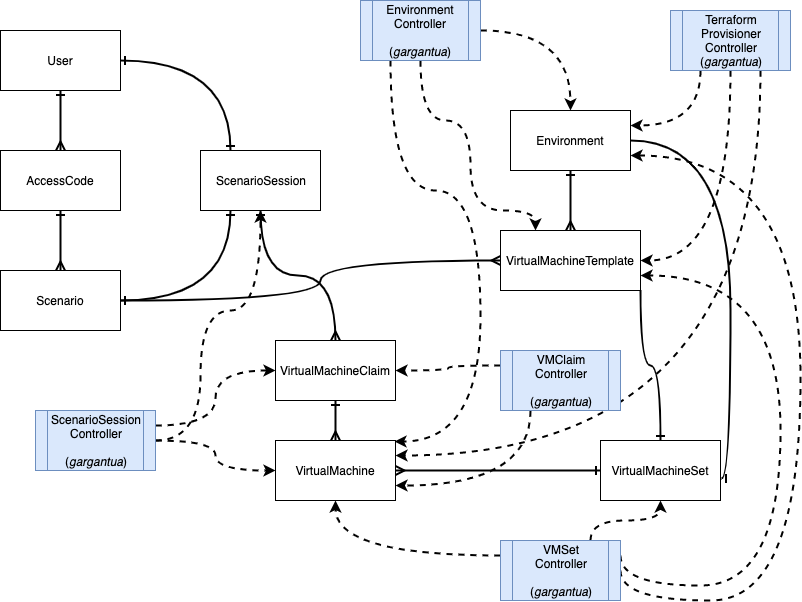

# gargantua
This repository hosts the core code for Gargantua, the megalith backend component of Hobby Farm. Currently, Hobby Farm is being built as a monolith, but will be transitioned into a proper microservices architecture one day™

Gargantua components:
Gargantua is based on K8S controllers, and provisions the following controllers to manage various aspects of HobbyFarm.
- Terraform Provsioner Controller
- VMClaim Controller
- VMSet Controller
- Environment Controller
- Session Controller

Their relationship is better illustrated with the following ERD:

## Contributing

If you're interested in contributing, see [CONTRIBUTING.md](CONTRIBUTING.md)
